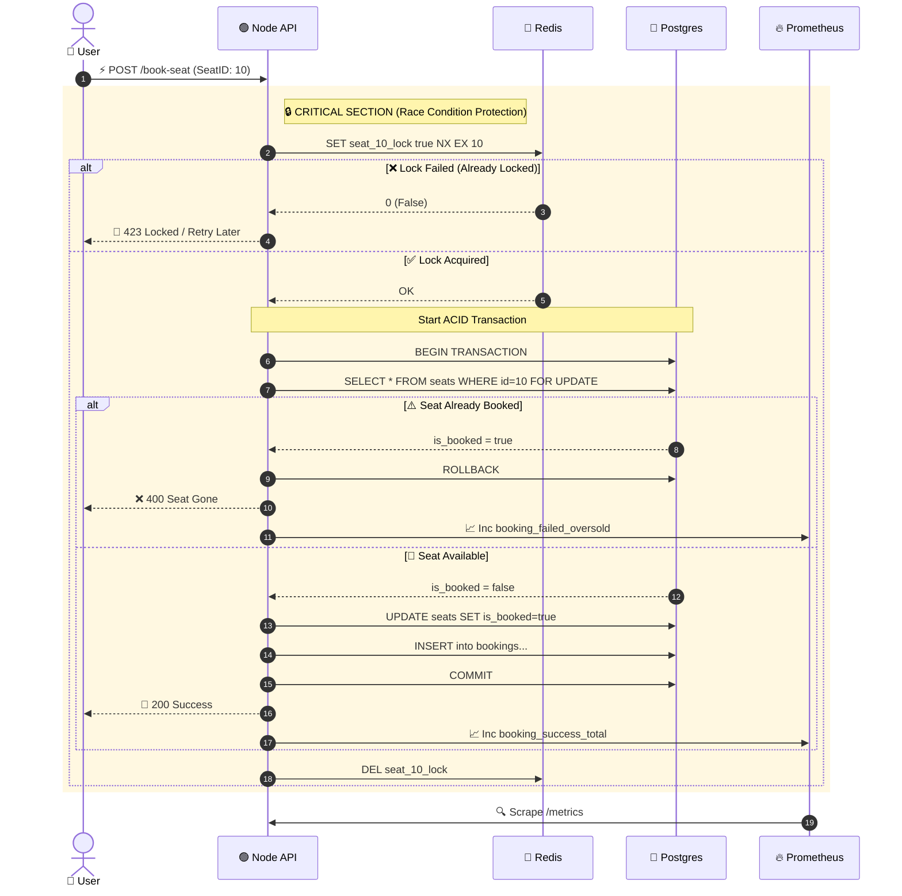

# 🎫 TicketRush – High-Volume Event Booking System

## 1. The Real-World Problem

**Imagine a popular concert (like Taylor Swift) or a limited sneaker drop.**

### 🚨 The Scenario
You have **100 tickets** available.

### 💥 The Traffic
**10,000 users** click "Buy" at the exact same second.

### 📉 The Failure
Without proper handling, a standard database setup might accidentally sell **120 tickets** because multiple users read the "available count" as `1` before the database updates it to `0`. This is a classic **Race Condition**.

### 🛡️ The Need
You need a system that:
*   **Handles High Traffic**: Processes thousands of requests concurrently.
*   **Ensures Data Consistency (ACID)**: Never oversells a seat.
*   **Caches Data**: Protects the database from being overwhelmed.
*   **Monitors Health**: Provides visibility so the system doesn't crash silently.

---

### 📸 Product Diagram

## 2. The Tech Stack Role

Here is how each technology is implemented to solve specific parts of this problem:

*   **Frontend (React + TypeScript + Tailwind)**:
    *   A clean UI showing a "Live Seat Map."
    *   Handles loading states gracefully when the backend is under heavy load.
*   **Backend (Node.js + TypeScript)**:
    *   The API that handles the booking logic and orchestration.
*   **Postgres**:
    *   The **"Source of Truth."**
    *   Stores the final confirmed reservations and user details.
*   **Redis**: The **Critical Component**.
    *   *Usage 1 (Caching)*: Stores the "Available Seat Count" to avoid hitting Postgres for every page load.
    *   *Usage 2 (Distributed Locking)*: Creates a "lock" on a specific seat ID so two people cannot buy it at the same time.
*   **Docker**:
    *   Containerizes the API, Database, Redis, and Monitoring tools.
    *   Enables the entire stack to spin up with one command: `docker-compose up`.
*   **Prometheus**:
    *   Scrapes metrics from the Node.js app (e.g., "Requests per second", "DB query duration").
*   **Grafana**:
    *   Visualizes the Prometheus data.
    *   Displays the "Traffic Spike" during flash sales and verifies system stability.

---

## 3. Development Lifecycle

### 🏗️ Phase 1: The Setup (Docker)
We use `docker-compose.yml` to spin up the entire infrastructure:
*   `postgres` (Database)
*   `redis` (Cache)
*   `prometheus` (Metrics)
*   `grafana` (Visualization)

### 🚀 Phase 2: The Backend (Node/Express)
**Endpoint:** `POST /book-seat`

#### The "Naive" Approach (Demonstrating the Failure)
1.  Select seat from DB.
2.  Check if `is_booked` is false.
3.  Update `is_booked` to true.
*   **Result**: Under load testing (e.g., 100 concurrent requests), this **oversells** the seat due to race conditions.

#### The "Pro" Approach (The Fix)
1.  **Redis Lock**: When a user clicks buy, acquire a lock in Redis: `SET seat_10_lock true NX EX 10` (Set if Not Exists, expire in 10s).
2.  **Check**:
    *   If lock fails: Return "Seat is currently being booked by someone else."
    *   If lock succeeds: Proceed to update Postgres.
3.  **Release**: Delete the lock in Redis.
*   **Result**: Zero overselling, guaranteed consistency.

### 📊 Phase 3: The Monitoring (Prometheus & Grafana)
We rely on custom metrics to prove the system works:
*   `booking_attempts_total` (Counter)
*   `booking_success_total` (Counter)
*   `booking_failed_oversold` (Counter)
*   `db_query_duration_seconds` (Histogram)

**Goal**: A Grafana dashboard showing a massive spike in "Attempts" but a flat line at 100 for "Success" (proving logic creates a ceiling matching inventory).

---

## 4. System Architecture

### 📐 System Architecture Diagram

Below is the logical flow of the system handling a booking request.

## 5. Why This Project Impresses Interviewers

This project moves beyond simple CRUD (Create, Read, Update, Delete). It demonstrates a deep understanding of:

1.  **Concurrency Control**: Handling multiple users fighting for a single resource without data corruption.
2.  **System Reliability**: Using Redis as a buffer to protect the primary database.
3.  **Observability**: Not just coding blindly—using Grafana dashboards to visualize real-time system performance and prove the implementation works under high load.
