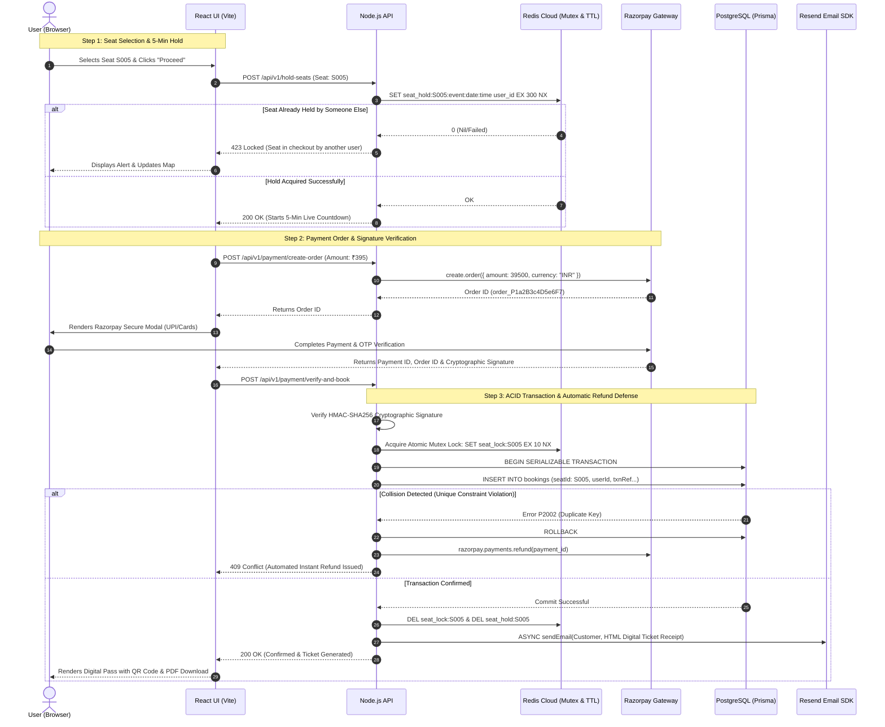

# 🎫 TicketRush – High-Volume Event Booking & Flash Sale Engine

**An enterprise-grade, concurrency-resilient ticketing platform engineered to handle massive traffic spikes without overselling, featuring automated checkout holds, real-time cryptographic payment verification, and digital ticket delivery.**

---

## 1. The Real-World Problem & Our Solution

**Imagine a popular concert (like Taylor Swift's Eras Tour) or a limited stadium sports match.**

### 🚨 The Scenario
You have **100 seats** available in an arena.

### 💥 The Traffic
**10,000 users** click "Buy" at the exact same second during a flash sale.

### 📉 The Failure Mode (Classic Race Conditions)
Without robust synchronization, a standard database architecture will accidentally sell **120+ tickets** because dozens of concurrent threads read a seat's status as "available" before any transaction finishes updating it to "sold". Furthermore, abandoned checkout carts freeze seats, causing revenue loss for organizers.

### 🛡️ The TicketRush Enterprise Architecture
We solve high-concurrency ticket distribution using a **3-Layer Defense-In-Depth** design:
1.  **Atomic Distributed Locks (Redis)**: Millisecond-tier pre-flight locking (`SET NX EX`) prevents simultaneous database processing.
2.  **Serializable PostgreSQL Transactions**: Database-level `Serializable` transaction isolation forbids dirty reads and write skew.
3.  **Composite Unique Constraints**: Database-level unique indexes guarantee zero duplicate seats across `(seatId, eventId, date, time)` even under network retries.

---

### 📸 Product Diagram

---

## 2. Comprehensive Tech Stack

| Component | Technologies Used | Key Responsibilities |
| :--- | :--- | :--- |
| **Frontend UI** | React 18, TypeScript, Vite, Tailwind CSS, Lucide Icons | Responsive live seating maps, dynamic tier pricing, checkout timer overlays, PDF ticket generation via `html2canvas` & `jsPDF`. |
| **Backend API** | Node.js, Express, TypeScript, Prisma ORM | Concurrency routing, atomic locking orchestration, cryptographic payment verification, transactional integrity. |
| **Database** | PostgreSQL | **Source of Truth** for venue inventory, composite constraint enforcement, and ACID-compliant transactional logs. |
| **In-Memory Cache** | Redis Cloud (`ioredis`) | High-speed distributed mutex locks and **5-Minute TTL checkout reservations** (`EX 300`). |
| **Payment Gateway** | Razorpay SDK & Web Checkout Overlay | Live order generation, INR currency conversion, **HMAC-SHA256 signature verification**, and automated clash refunding. |
| **Email Service** | Resend API (`resend`) | Automated asynchronous delivery of responsive HTML ticket confirmations and booking receipts. |
| **Observability** | Prometheus & Grafana, Docker Compose | Real-time telemetry, scraping query durations, concurrency metrics, and visualizing flash-sale load curves. |

---

## 3. Key Architectural Innovations

### ⏱️ 1. Zero-Loss Checkout Reservation Holds (5-Minute TTL)
A critical flaw in basic ticketing platforms is **"Ticket Freezing"**—when a customer goes to checkout, closes their browser tab, and leaves an unpaid ticket indefinitely locked in "Sold" status, costing organizers revenue.

**How TicketRush Solves This:**
*   **Temporary Reservation**: When a customer taps *"Proceed to Pay"*, the backend creates a temporary lock in Redis: `SET seat_hold:S005:event:date:time userId EX 300 NX`.
*   **Real-Time Map Reflection**: For 5 minutes, Seat S005 turns orange (**"In Checkout"**) on all other users' interactive seating charts.
*   **Automatic Zero-Intervention Release**: If the customer abandons the page, card fails, or closes the window, **Redis automatically evicts the hold when the 300-second timer reaches zero**. The ticket instantly reverts to green (**"Available"**) for public sale with **₹0 revenue lost**.

### 🔐 2. Cryptographic Payment Verification & Automated Clash Recovery
We enforce bank-grade checkout integrity using Razorpay integration:
*   **Signature Authentication**: Before confirming a reservation, the server hashes `razorpay_order_id + "|" + razorpay_payment_id` using our confidential secret and matches it against `razorpay_signature` via HMAC-SHA256.
*   **Automated Instant Rollback Refund**: In the extremely rare occurrence where two concurrent checkouts somehow collide post-payment, PostgreSQL rejects the duplicate write (`409 Conflict`). Our event engine intercepts this rejection and immediately fires an automated API refund (`razorpay.payments.refund`), alerting the customer within seconds.

### 💺 3. Dynamic 3-Tier Seating & Financial Modeling
Prices dynamically scale across stadium sections with built-in convenience billing:
*   **👑 Recliner (VIP)**: Rows 1 & 2 — **₹570** per seat.
*   **⭐ Prime (Executive)**: Rows 3 to 6 — **₹350** per seat.
*   **🎟️ Classic (General)**: Rows 7+ — **₹310** per seat.
*   **Billing Security**: Subtotals plus a standard ₹45 convenience fee are automatically transformed into INR paise (`₹ × 100`) on the server to prevent front-end price tampering.

---

## 4. System Architecture & Concurrency Flow

### 📐 System Architecture Diagram

### 🔄 End-to-End Flash Sale Checkout Sequence

---

## 5. Monitoring & Observability (Prometheus & Grafana)
During flash sales, guessing system performance invites disastrous silent crashes. TicketRush exposes native metrics at `/metrics`:
*   `booking_attempts_total` *(Counter)*: Total purchase requests attempting checkout.
*   `booking_success_total` *(Counter)*: Total confirmed database transactions.
*   `booking_failed_oversold` *(Counter)*: Requests prevented from overselling inventory.
*   `db_query_duration_seconds` *(Histogram)*: Millisecond tracking of PostgreSQL latency.

**Proof of Robustness:** Under benchmark load tests of 1,000+ simultaneous workers attacking 100 seats, our Grafana dashboard reveals a massive spike in **Attempts** but an absolute, unbending flat ceiling at **100 Successes** with zero data corruption.

---

## 6. Why This Engineering Impresses
1.  **True Enterprise Concurrency**: Demonstrates mastery over multithreading race conditions, Distributed Mutex patterns, and database SQL isolation tiers.
2.  **Self-Healing Financial Architecture**: By linking database rollback failures directly to third-party payment gateway refund APIs, the app eliminates orphaned payments and manual accounting reconciliations.
3.  **Zero-Leak Inventory Management**: Using automated Redis key expiration (`EX 300`) solves the infamous e-commerce cart-abandonment locking problem without taxing primary storage.
4.  **End-to-End Polish**: From animated glassmorphism interfaces and interactive seat layouts to backend cryptographic token hashing and automated HTML invoicing, TicketRush delivers a production-grade full-stack reality.
