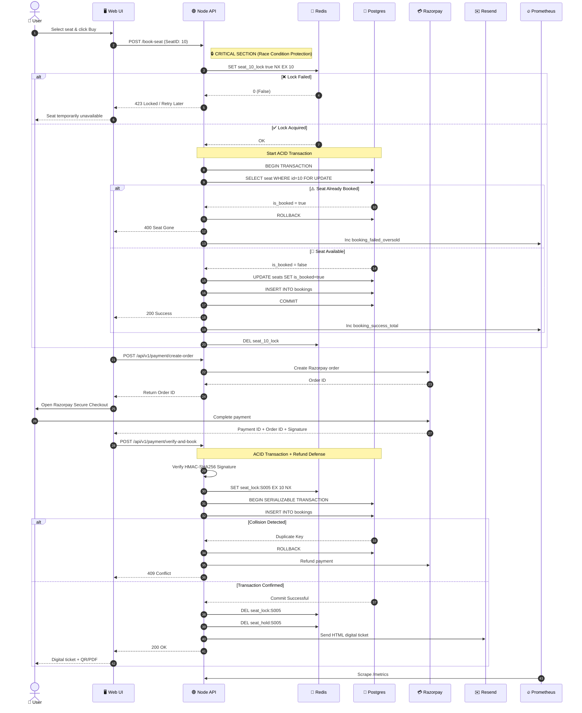

# 🎫 TicketRush – High-Volume Event Booking & Flash Sale Engine

**An enterprise-grade, concurrency-resilient ticketing platform engineered to handle massive traffic spikes without overselling, featuring automated checkout holds, real-time cryptographic payment verification, and digital ticket delivery.**

  

## Live Website
[Visit TicketRush Live](https://ticketrush.vercel.app)

## 1. The Real-World Problem

---

## 1. The Real-World Problem & Our Solution

**Imagine a popular concert (like Taylor Swift's Eras Tour) or a limited stadium sports match.**

### 🚨 The Scenario
You have **100 seats** available in an arena.

### 💥 The Traffic
**10,000 users** click "Buy" at the exact same second during a flash sale.

### 📉 The Failure Mode (Classic Race Conditions)
Without robust synchronization, a standard database architecture will accidentally sell **120+ tickets** because dozens of concurrent threads read a seat's status as "available" before any transaction finishes updating it to "sold". Furthermore, abandoned checkout carts freeze seats, causing revenue loss for organizers.

### 🛡️ The TicketRush Enterprise Architecture
We solve high-concurrency ticket distribution using a **3-Layer Defense-In-Depth** design:
1.  **Atomic Distributed Locks (Redis)**: Millisecond-tier pre-flight locking (`SET NX EX`) prevents simultaneous database processing.
2.  **Serializable PostgreSQL Transactions**: Database-level `Serializable` transaction isolation forbids dirty reads and write skew.
3.  **Composite Unique Constraints**: Database-level unique indexes guarantee zero duplicate seats across `(seatId, eventId, date, time)` even under network retries.

---

### 📸 Product Diagram

---

## 2. Comprehensive Tech Stack

| Component | Technologies Used | Key Responsibilities |
| :--- | :--- | :--- |
| **Frontend UI** | React 18, TypeScript, Vite, Tailwind CSS, Lucide Icons | Responsive live seating maps, dynamic tier pricing, checkout timer overlays, PDF ticket generation via `html2canvas` & `jsPDF`. |
| **Backend API** | Node.js, Express, TypeScript, Prisma ORM | Concurrency routing, atomic locking orchestration, cryptographic payment verification, transactional integrity. |
| **Database** | PostgreSQL | **Source of Truth** for venue inventory, composite constraint enforcement, and ACID-compliant transactional logs. |
| **In-Memory Cache** | Redis Cloud (`ioredis`) | High-speed distributed mutex locks and **5-Minute TTL checkout reservations** (`EX 300`). |
| **Payment Gateway** | Razorpay SDK & Web Checkout Overlay | Live order generation, INR currency conversion, **HMAC-SHA256 signature verification**, and automated clash refunding. |
| **Email Service** | Resend API (`resend`) | Automated asynchronous delivery of responsive HTML ticket confirmations and booking receipts. |
| **Observability** | Prometheus & Grafana, Docker Compose | Real-time telemetry, scraping query durations, concurrency metrics, and visualizing flash-sale load curves. |

---

## 3. Development Lifecycle

### 🏗️ Phase 1: The Setup (Docker)
We use `docker-compose.yml` to spin up the entire infrastructure:
*   `postgres` (Database)
*   `redis` (Cache)
*   `prometheus` (Metrics)
*   `grafana` (Visualization)

### 🚀 Phase 2: The Backend (Node/Express)
**Endpoint:** `POST /book-seat`

#### The "Naive" Approach (Demonstrating the Failure)
1.  Select seat from DB.
2.  Check if `is_booked` is false.
3.  Update `is_booked` to true.
*   **Result**: Under load testing (e.g., 100 concurrent requests), this **oversells** the seat due to race conditions.

#### The "Pro" Approach (The Fix)
1.  **Redis Lock**: When a user clicks buy, acquire a lock in Redis: `SET seat_10_lock true NX EX 10` (Set if Not Exists, expire in 10s).
2.  **Check**:
    *   If lock fails: Return "Seat is currently being booked by someone else."
    *   If lock succeeds: Proceed to update Postgres.
3.  **Release**: Delete the lock in Redis.
*   **Result**: Zero overselling, guaranteed consistency.

### 📊 Phase 3: The Monitoring (Prometheus & Grafana)
We rely on custom metrics to prove the system works:
*   `booking_attempts_total` (Counter)
*   `booking_success_total` (Counter)
*   `booking_failed_oversold` (Counter)
*   `db_query_duration_seconds` (Histogram)

**Goal**: A Grafana dashboard showing a massive spike in "Attempts" but a flat line at 100 for "Success" (proving logic creates a ceiling matching inventory).

---

## 4. System Architecture & Concurrency Flow

### 📐 System Architecture Diagram

### 🔄 End-to-End Flash Sale Checkout Sequence

---

## 5. Monitoring & Observability (Prometheus & Grafana)
During flash sales, guessing system performance invites disastrous silent crashes. TicketRush exposes native metrics at `/metrics`:
*   `booking_attempts_total` *(Counter)*: Total purchase requests attempting checkout.
*   `booking_success_total` *(Counter)*: Total confirmed database transactions.
*   `booking_failed_oversold` *(Counter)*: Requests prevented from overselling inventory.
*   `db_query_duration_seconds` *(Histogram)*: Millisecond tracking of PostgreSQL latency.

**Proof of Robustness:** Under benchmark load tests of 1,000+ simultaneous workers attacking 100 seats, our Grafana dashboard reveals a massive spike in **Attempts** but an absolute, unbending flat ceiling at **100 Successes** with zero data corruption.

---

1.  **Concurrency Control**: Handling multiple users fighting for a single resource without data corruption.
2.  **System Reliability**: Using Redis as a buffer to protect the primary database.
3.  **Observability**: Not just coding blindly—using Grafana dashboards to visualize real-time system performance and prove the implementation works under high load.

## Grafana & Prometheus

