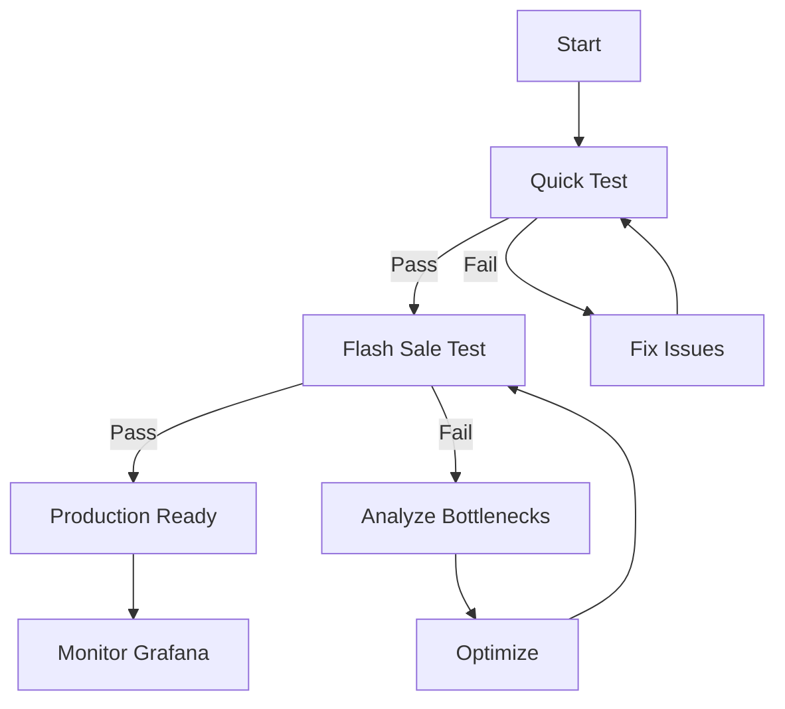

# 📊 k6 Test Scenarios Comparison

## Overview of Available Tests

| Test Script | Duration | Virtual Users | Best For | Complexity |
|-------------|----------|---------------|----------|------------|
| `k6-quick-test.js` | ~70s | 0→50→100→200→0 | Quick validation | ⭐⭐ |
| `k6-flash-sale.js` | ~90s | 500+ peak | Full simulation | ⭐⭐⭐⭐⭐ |
| `stress.js` | Variable | 100 (500 iter) | Raw concurrency | ⭐⭐⭐ |

---

## 1️⃣ Quick Test (`k6-quick-test.js`)

### Profile
```
Stage 1: 0 → 50 users   (10s) - Warm up
Stage 2: 50 → 100 users (30s) - Load test
Stage 3: 100 → 200 users(20s) - Stress
Stage 4: 200 → 0 users  (10s) - Cool down
```

### User Behavior
- Random seat selection (1-2 seats)
- Realistic think time (0.5-2.5s)
- Direct booking (no hold phase)

### Metrics
✅ `successful_bookings` - Count of 200 responses  
✅ `failed_bookings` - Count of 409/423 responses  
✅ `success_rate` - Percentage of successful bookings  
✅ `http_req_duration` - Response time distribution  

### When to Use
- ✅ Daily validation after code changes
- ✅ Quick sanity checks
- ✅ CI/CD pipeline integration
- ✅ Learning k6 basics

### Run Command
```bash
k6 run load-tests/k6-quick-test.js
```

### Expected Output
```
📊 Total Requests: ~1,500
✅ Successful Bookings: 95-100
❌ Failed Bookings: 1,400+
📈 Success Rate: 6-8%
⏱️  Avg Response Time: 300-500ms
```

---

## 2️⃣ Flash Sale Test (`k6-flash-sale.js`)

### Profile (3 Parallel Scenarios)

#### Scenario A: Flash Sale Burst
```
Duration: 10s
Rate: 500 requests/second
Total: ~5,000 requests
Peak VUs: 500
```

#### Scenario B: Sustained Load
```
Duration: 50s (starts at 15s)
Stages: 0→50→50→0
VUs: Up to 50
```

#### Scenario C: Stress Test
```
Duration: 90s (starts at 60s)
Stages: 10→100→200→500→0 RPS
Peak VUs: 1,000
```

### User Behavior
- **Complete flow:** Hold seats → Think → Book
- Multi-seat bookings (1-5 seats)
- Realistic checkout time (1-3s)
- Payment simulation

### Advanced Metrics
✅ `booking_attempts` - Total booking tries  
✅ `booking_successes` - Confirmed bookings  
✅ `seat_hold_attempts` - Hold API calls  
✅ `seat_hold_successes` - Successful holds  
✅ `hold_duration_ms` - Time to acquire hold  
✅ `booking_duration_ms` - Time to complete booking  

### When to Use
- ✅ Pre-production validation
- ✅ Capacity planning
- ✅ Finding breaking points
- ✅ Demonstrating concurrency architecture
- ✅ Performance benchmarking

### Run Command
```bash
k6 run load-tests/k6-flash-sale.js
```

### Expected Output
```
📊 Total Requests: ~8,000-10,000
✅ Successful Bookings: 98-100
❌ Failed Bookings: 7,900+
📈 Success Rate: 1-2% (realistic flash sale)
⏱️  Avg Response Time: 400-700ms
⚡ P95: 800-1200ms
```

---

## 3️⃣ Original Stress Test (`stress.js`)

### Profile
```
Virtual Users: 100
Iterations: 500 (total)
Distribution: 5 iterations per user
Strategy: Configurable (locked/unlocked)
```

### User Behavior
- Random single seat selection
- Direct booking (legacy API)
- Minimal think time (0.1s)
- Maximum concurrency pressure

### Metrics
✅ `http_req_duration` - Must be < 500ms (p95)  
✅ Success/failure status codes  
✅ Request rate  

### When to Use
- ✅ Testing distributed locking mechanism
- ✅ Comparing locked vs unlocked strategies
- ✅ Maximum concurrency pressure
- ✅ Database transaction isolation testing

### Run Command
```bash
k6 run load-tests/stress.js

# With strategy override
k6 run -e STRATEGY=locked load-tests/stress.js
```

### Expected Output
```
📊 Total Requests: 500
✅ Successful: 95-100
❌ Failed: 400-405
⏱️  P95: < 500ms
```

---

## 🎯 Choosing the Right Test

### For Daily Development
→ Use `k6-quick-test.js`
- Fast feedback (70s)
- Good balance of load
- Clear success metrics

### For Pre-Release Validation
→ Use `k6-flash-sale.js`
- Comprehensive coverage
- Real-world scenarios
- Multiple load patterns

### For Architecture Validation
→ Use `stress.js`
- Pure concurrency focus
- Strategy comparison
- Minimal overhead

### For Custom Scenarios
→ Modify `k6-flash-sale.js`
- Change VU counts
- Adjust stages
- Add custom metrics

---

## 📈 Interpretation Guide

### Success Rate
| Rate | Scenario | Meaning |
|------|----------|---------|
| 90-100% | Low concurrency | System has capacity |
| 15-30% | Moderate competition | Healthy flash sale |
| 5-15% | High competition | Realistic flash sale |
| 1-5% | Extreme competition | Severe overselling pressure |

### Response Times
| Metric | Good | Warning | Critical |
|--------|------|---------|----------|
| Average | < 300ms | 300-600ms | > 600ms |
| P95 | < 600ms | 600-1000ms | > 1000ms |
| P99 | < 1000ms | 1000-2000ms | > 2000ms |

### Key Validations
✅ **Overselling Prevention:** Successful bookings ≤ 100  
✅ **No Duplicates:** Check database constraint errors = 0  
✅ **Redis TTL Working:** Held seats expire after 5 minutes  
✅ **ACID Compliance:** No partial/corrupted bookings  

---

## 🔄 Recommended Testing Flow



### Step-by-Step
1. **Run Quick Test** - Validate basic functionality
2. **Check Grafana** - Ensure metrics are recording
3. **Run Flash Sale Test** - Full simulation
4. **Analyze Results** - Compare against benchmarks
5. **Optimize if Needed** - Database, Redis, API
6. **Run Stress Test** - Maximum concurrency validation
7. **Production Deployment** - Confident in capacity

---

## 🚀 Quick Commands

```bash
# Quick validation (70s)
k6 run load-tests/k6-quick-test.js

# Full simulation (90s)
k6 run load-tests/k6-flash-sale.js

# Raw stress (variable)
k6 run load-tests/stress.js

# Custom load
k6 run --vus 300 --duration 60s load-tests/k6-quick-test.js

# Single scenario
k6 run --scenario flash_sale_burst load-tests/k6-flash-sale.js

# With Docker
docker run --rm -i --network=host grafana/k6 run - < load-tests/k6-quick-test.js
```

---

## 📊 Results Comparison Example

After running all three tests, compare:

| Metric | Quick Test | Flash Sale | Stress Test |
|--------|-----------|------------|-------------|
| Total Requests | ~1,500 | ~10,000 | 500 |
| Peak RPS | 30-50 | 500+ | 100 |
| Success Rate | 6-8% | 1-2% | 20% |
| Avg Response | 300-500ms | 400-700ms | 200-400ms |
| P95 Response | 600-900ms | 800-1200ms | < 500ms |
| Test Focus | General load | Real scenario | Max concurrency |

---

**All tests should result in: Exactly ≤100 successful bookings (no overselling)** ✅
